# 📊 Testing Dashboard & Enforcement System

*"You read a scroll labeled TEST ENFORCEMENT SYSTEM. You feel a sense of discipline."*

## Overview

This project implements **mandatory test logging** with a visual dashboard to track test quality over time and prevent regressions. It's like the Rogue Monitor, but for your code quality.

> **The Oracle says**: *"A test not logged is a bug waiting to happen. Choose your commits wisely, for they shall be measured."*

## 🎯 Two Approaches Available

*You see here two scrolls:*

### a) Git Notes Approach ⭐ (blessed)

**Authoritative data**: Git notes attached to commits
**Dashboard data**: Mirrored JSONL (one commit behind)

**Advantages**:
- ✅ One commit per change (clean dungeon... er, history)
- ✅ Notes can reference commit hash (the Amulet of Yendor of testing!)
- ✅ Test data travels with commits (like a bag of holding)
- ✅ Can't forget (enforced by hooks, like a shop lock)

**Documentation**: [docs/TESTING_GIT_NOTES.md](TESTING_GIT_NOTES.md)

*This scroll appears to be blessed. Would you like to read it? [yn]*

### b) Two-Commit Approach (uncursed, but dusty)

**All data**: In teststats/results.jsonl
**Workflow**: Code commit + test log commit

**Advantages**:
- ✅ Simple (no git notes to manage)
- ✅ All data in one file (like a scroll of identify)

**Disadvantages**:
- ❌ Two commits per change (double movement speed, but you're burdened)
- ❌ Cluttered git history (like a pack rat's inventory)
- ❌ Easy to forget second commit (oops! You forgot to pray!)

**Documentation**: [TESTING.md](TESTING.md)

*This scroll looks old and worn. It might still work, but the blessed one is shinier.*

## 🚀 Quick Start (Git Notes)

*The scroll reads: "Speak these incantations to summon the Testing Daemon..."*

### 1. Enable Git Hooks & Configure Auto-Push

```bash
# Engrave Elbereth... er, enable hooks
git config core.hooksPath .githooks

# Auto-push notes with commits (like a wand of teleportation for your data)
git config --add remote.origin.push '+refs/notes/test-results:refs/notes/test-results'
```

*You feel your repository becoming more disciplined.*

### 2. Make Changes & Commit

*Use the magic helper scroll for easy workflow:*

```bash
# Edit files (apply a blessed +1 fix to your code)
vim js/levels/themerms.js

# Commit with automatic testing (cast "test and log"!)
.githooks/commit-with-tests-notes.sh "Fix reservoir sampling" js/levels/themerms.js

# Push (ascend with the Amulet!)
git push
```

*The voice of the Oracle echoes: "Your tests have been logged. The dashboard shows 137 passing tests. This is a good thing."*

That's it! The scroll of commit-with-tests handles:
1. ⚗️ Committing your code (mixing the potion)
2. 🔬 Running tests and saving to git note (identifying the potion)
3. 📜 Syncing notes to results.jsonl (updating your conduct)
4. 💾 Committing the updated JSONL (engraving Elbereth)
5. ✨ Ready to push! (ascending the stairs)

## 📈 View Dashboard

**The Oracle's Chamber (GitHub Pages)**:
```
https://davidbau.github.io/mazesofmenace/teststats/
```

*A mysterious force prevents you from accessing this until you push to GitHub.*

**Local Divination**:
```bash
open teststats/index.html
```

*You gaze into the crystal ball and see the future of your test suite...*

## 🎯 Key Features

### Test Enforcement

*The Wizard of Yendor enforces these rules:*

- ✅ **No regressions allowed** - Passing tests can't become failing (like the Amulet, they must not be lost!)
- ✅ **Every commit logged** - Test results tracked in git notes + JSONL mirror (your conduct is recorded)
- ✅ **CI verification** - GitHub Actions enforces test logging (the Wizard is watching)
- ✅ **Pre-push protection** - Local hook prevents bad pushes (trapped door!)

*Violate these, and thou shalt not pass!*

### Dashboard

*The Oracle's crystal ball reveals:*

- 📈 **Timeline visualization** - Pass/fail trends over commits (your ascension progress)
- 📊 **Category breakdown** - Tests grouped by type (map, gameplay, chargen) (like monster classes)
- 🔍 **Commit scrubber** - Navigate through history (time travel via level teleport)
- ⚠️ **Regression highlights** - Visual warnings for test quality drops (cursed items blink red!)
- 📋 **Detailed table** - Recent commits with deltas (your score and conduct)

## 📁 Inventory

*You are carrying:*

```
teststats/
├── index.html          # a) blessed scroll of Dashboard UI
├── dashboard.js        # b) wand of Visualization (0:∞)
├── dashboard.css       # c) cloak of Styling [+0]
├── results.jsonl       # d) Book of Test History (mirrored from notes)
└── schema.json         # e) scroll labeled "LOG FORMAT"

.githooks/
├── pre-push-notes      # f) magic trap (triggers on push)
├── pre-commit          # g) squeaky board (sync notes → JSONL)
├── test-and-log-to-note.sh       # h) wand of Testing
├── sync-notes-to-jsonl.sh        # i) ring of Synchronization
├── commit-with-tests-notes.sh    # j) blessed scroll of Easy Workflow
├── pre-push            # k) dusty magic trap (legacy)
├── test-and-log.sh     # l) old wand of Testing (uncharged)
├── commit-with-tests.sh  # m) worn scroll (legacy)
└── README.md           # n) scroll of Hook Documentation

docs/
├── TESTING_GIT_NOTES.md  # o) spellbook of Git Notes ⭐
└── TESTING.md            # p) old spellbook (still readable)

.github/workflows/
└── test-enforcement.yml  # q) Scroll of GitHub Actions
```

*Your pack weighs 0 zorkmids. You are not burdened (everything is in git!)*

## 🔄 How Git Notes Workflow Works

*The Oracle explains with a diagram:*

```mermaid
graph LR
    A[📝 Edit Code] --> B[💾 Commit Code]
    B --> C[🧪 Run Tests]
    C --> D[📌 Save to Git Note]
    D --> E[🔄 Sync Notes → JSONL]
    E --> F[💿 Commit JSONL]
    F --> G[🚀 Push Both]
```



### The Chicken-and-Egg Problem (a.k.a. The Paradox of Temporal Causality)

**Problem**: *"How can a commit name itself ere it exists? 'Tis like trying to eat a cockatrice corpse before thou hast slain it!"*

A commit can't contain its own hash in a file because the hash doesn't exist until after the commit is created.

**Solution**: **Git notes!**
*"The Wizards of old solved this with a clever trick..."*

- Test results stored as **notes attached to commits** (like name tags on corpses)
- Notes can reference the commit hash (because they're attached AFTER the commit exists!)
- `teststats/results.jsonl` is rebuilt from notes (one commit behind for the dashboard)

*"A blessed solution indeed! The Wizard approves."*

### Architecture (The Dungeon Layout)

```
         Level 1: Git Notes (Authoritative)
┌────────────────────────────────────────────────┐
│  refs/notes/test-results                       │
│  "The vaults where true knowledge is stored"   │
│                                                 │
│  commit abc123 → {results for abc123}          │
│  commit def456 → {results for def456}          │
└────────────┬───────────────────────────────────┘
             │ ↓ sync-notes-to-jsonl.sh
             │   (A stairway down...)
         Level 2: JSONL Mirror
┌────────────────────────────────────────────────┐
│  teststats/results.jsonl                       │
│  "A magical mirror reflecting level 1"         │
│                                                 │
│  One entry per commit, chronologically sorted  │
└────────────┬───────────────────────────────────┘
             │ ↓ GitHub Pages
             │   (The astral plane...)
       The Oracle's Chamber
┌────────────────────────────────────────────────┐
│  https://github.io/.../teststats/              │
│  "Where mortals come to seek wisdom"           │
│                                                 │
│  📊 Timeline, Charts, Scrubber                 │
└────────────────────────────────────────────────┘
```

## 📝 Test Log Format (The Scroll of Recording)

*JSONL (newline-delimited JSON) - one entry per commit:*

```jsonl
{"commit":"abc123","date":"2026-02-11T10:30:00Z","stats":{"total":631,"pass":137,"fail":494},"regression":false,...}
```

*Each line is a complete message. Together they form the Book of Testing.*

**Benefits** (or: Why JSONL is a blessed +2 format):
- ✅ Append-only (like a !oW scroll - Write Only)
- ✅ Merge-friendly (sort by date, like sorting gems by value)
- ✅ Git-friendly (line-based diffs, like counting inventory)
- ✅ Easy to parse (jq is your friend, like a tame pet)

## ⚠️ Handling Regressions

*The Wizard is displeased. Your test count decreased! Choose thy path:*

### Path A: Fix the Regression (Lawful)

*"The righteous path. Make things right."*

```bash
# Fix the issue (quaff a potion of restore ability)
vim js/file.js
git add js/file.js
git commit --amend --no-edit

# Re-run tests (pray at the altar)
.githooks/test-and-log-to-note.sh
```

*The Wizard smiles upon you. +1 Wisdom.*

### Path B: Allow Regression (Neutral, Requires Justification)

*"Sometimes the greater good requires temporary setbacks. But thou must explain thyself!"*

```bash
# Run tests with override flag (eat a cursed scroll knowingly)
.githooks/test-and-log-to-note.sh --allow-regression

# Then follow normal workflow
```

*The Wizard eyes you suspiciously. You'd better have a good explanation in your commit message!*

**Example good justification**:
```
Allow regression: fixing core algorithm

The reservoir sampling fix causes 25 test failures because it changes
the RNG sequence. The failures are cascading effects, not actual bugs.
The algorithm is now correct per C source verification. Like killing
the Wizard to get the Book - necessary, but temporarily painful.
```

*Acceptable. -1 Charisma, but +3 Wisdom for being honest.*

### Path C: Push Anyway (Chaotic, Forbidden)

```bash
git push --no-verify  # DON'T DO THIS
```

*The Wizard of Yendor appears! "So thou thought thou couldst cheat?" --More--*

*The Wizard casts a spell of CI FAILURE at you! GitHub Actions rejects your push.*

*You die... Do you want your possessions identified? [ynq]*

## 🛠️ Troubleshooting (Common Mishaps)

### "Tests Not Running" (You see here a scroll that does nothing)

```bash
# Verify hook setup (check if you're wearing the amulet)
git config core.hooksPath
# Should output: .githooks

# Ensure executable (bless the scrolls)
chmod +x .githooks/*
```

*The scrolls were cursed (not executable)! They work now.*

### "Notes Not Pushing" (Your items scatter!)

```bash
# Check if notes exist (search the floor)
git notes --ref=test-results list

# Manual push (throw the items upstairs)
git push origin refs/notes/test-results

# Or configure automatic push (hire a pack animal)
git config --add remote.origin.push '+refs/notes/test-results:refs/notes/test-results'
```

*Now your notes follow you everywhere! Like a loyal dog, but for git.*

### "Dashboard Not Updating" (The crystal ball is cloudy)

```bash
# Rebuild JSONL from git notes (polish the crystal ball)
.githooks/sync-notes-to-jsonl.sh

# Commit and push (present it to the Oracle)
git add teststats/results.jsonl
git commit -m "Rebuild dashboard from git notes"
git push
```

*The mists clear. You see your test results!*

### "Missing Notes After Clone" (You feel empty handed)

```bash
# Fetch notes (search the level you just arrived on)
git fetch origin refs/notes/test-results:refs/notes/test-results

# Rebuild dashboard (reconstruct from memory)
.githooks/sync-notes-to-jsonl.sh
```

*You find everything where you left it! (Well, where git left it.)*

## 📚 Scrolls of Knowledge

*A library. The shelves are lined with dusty tomes:*

- **a)** Quick Start: This file (you are here!)
- **b)** [Git Notes Workflow](TESTING_GIT_NOTES.md) ⭐ *blessed*
- **c)** [Two-Commit Workflow](TESTING.md) *uncursed (legacy)*
- **d)** [Hook Details](../.githooks/README.md) *"Hooks, Runes, and Trigger Mechanisms"*
- **e)** [Dashboard Info](../teststats/README.md) *"The Oracle's Crystal Ball Manual"*
- **f)** [Schema](../teststats/schema.json) *"The Sacred Format of Test Logs"*

*Which scroll would you like to read?*

## 🎯 The Four Noble Truths of Testing

*The Oracle speaks:*

1. **Prevent regressions** - *"Never let test quality degrade silently, lest bugs multiply like killer bees"*
2. **Track progress** - *"Visualize test improvements over time, for what is measured improves"*
3. **Enforce discipline** - *"Every commit must be tested, as every meal must be eaten"*
4. **Enable debugging** - *"Historical data helps identify when bugs were introduced, like tracking monster movement"*

## 🤝 Conduct for Adventurers (Contributing)

*All who enter the dungeon **must** follow these rules:*

1. Enable git hooks: `git config core.hooksPath .githooks`
   *"Equip your armor before battle"*

2. Configure auto-push: `git config --add remote.origin.push '+refs/notes/test-results:refs/notes/test-results'`
   *"Ensure your achievements are recorded"*

3. Run tests before pushing
   *"Look before you leap into the pit"*

4. Never push regressions without explicit justification
   *"Do not anger the Wizard without good reason"*

5. Use `.githooks/commit-with-tests-notes.sh` helper for easy workflow
   *"Use your blessed scroll - why make things harder?"*

*Violators will be turned into newts. (They might get better, but probably not.)*

## ❓ The Oracle Answers Common Questions

**Q: Why git notes instead of files in commits?**
*Oracle: "The chicken-and-egg problem - a commit cannot name itself ere it exists! Git notes are attached AFTER creation, solving the paradox. 'Tis like casting identify AFTER picking up the ring."*

**Q: Why is the dashboard one commit behind?**
*Oracle: "The pre-commit hook syncs notes → JSONL, so the current commit's note isn't synced yet. This is the price of temporal consistency. Fear not - the dashboard shows historical data, not real-time divination."*

**Q: Can I see notes in GitHub UI?**
*Oracle: "Alas, no. Notes dwell in the shadow plane, invisible to GitHub's web interface. Use `git notes` commands or view the dashboard instead."*

**Q: What if I forget to push notes?**
*Oracle: "Configure automatic push (see setup above). Then `git push` carries all - commits AND notes - like a bag of holding for your achievements."*

**Q: What happens on merge?**
*Oracle: "Notes from both branches are preserved, like items from merged inventories. The sync script rebuilds JSONL sorted chronologically. All is well."*

**Q: Can I still use the two-commit approach?**
*Oracle: "Aye. Both scrolls work, though one is blessed. See [TESTING.md](TESTING.md) for the ancient way."*

**Q: What if I break the build?**
*Oracle: "The Wizard will be... displeased. Fix it quickly, or face the wrath of CI. Your shame will be recorded in the dashboard for all to see. This is the way."*

---

*You read the final line of the scroll...*

**View live dashboard**: https://davidbau.github.io/mazesofmenace/teststats/

*The scroll crumbles to dust. You feel enlightened about testing.*

*Would you like to write your name in the high score table? [yn]* **y**

```
                    .githooks/commit-with-tests-notes.sh
                    =====================================
                       Your Path to Testing Glory
```

*May your tests always pass, and your merges always be conflict-free.*

*Happy hacking, adventurer!*

## 🎮 Achievement Unlocked

- ✅ Read the Testing Scroll
- ⏳ Enable Git Hooks (pending)
- ⏳ Make First Commit with Tests (pending)
- ⏳ View Dashboard (pending)
- ⏳ Survive a Merge Conflict (pending)
- ⏳ Achieve 90% Pass Rate (pending)
- ⏳ Ascend (ship v1.0) (pending)

*Your current conduct: Testing discipline (not broken). Keep it up!*

---

## 📊 Backfilling Test History

*"The Oracle can see the past... if you help her remember."*

Want to populate the dashboard with historical data? The backfill script runs tests on old commits:

### Quick Start

```bash
# See what would be tested (dry run)
scripts/backfill-test-history-safe.sh --dry-run

# Backfill last 10 commits (safe, fast)
scripts/backfill-test-history-safe.sh

# Backfill more history
scripts/backfill-test-history.sh 50

# After backfilling, sync and commit
.githooks/sync-notes-to-jsonl.sh
git add teststats/results.jsonl
git commit -m "Backfill test history"
git push origin refs/notes/test-results
```

### How It Works

The backfill script:
1. ✅ Finds commits without test notes
2. ✅ Checks out each commit
3. ✅ Runs tests (if possible)
4. ✅ Creates git note with results
5. ✅ Skips commits where tests don't work
6. ✅ Restores your original state

Each git note contains **only that commit's results** (not cumulative). The JSONL file aggregates all notes for the dashboard.

### Safety Features

- Checks for clean working directory
- Restores original branch/commit when done
- Skips commits where tests don't exist
- Handles npm install failures gracefully
- Logs all results for review

### What Gets Skipped

- Commits without test directory
- Commits where npm install fails
- Commits where tests crash
- Very old commits (before tests existed)

This is fine! The backfill is best-effort.

---
